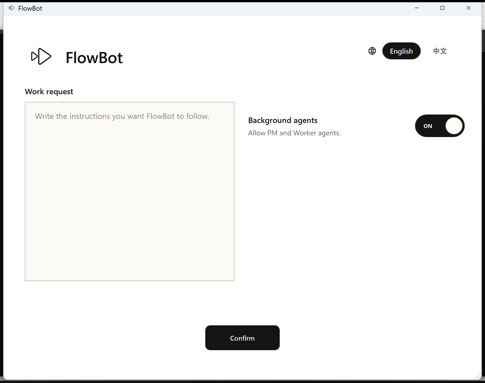

# FlowBot

<!-- README HERO START -->
<p align="center">
  
</p>

<p align="center">
  <strong>A lightweight FlowGuard-backed work loop for turning explicit AI tasks into one executable route.</strong>
</p>

<p align="center">
  Source version: <strong>v0.1.1</strong> · MIT License · Codex skill source package
</p>
<!-- README HERO END -->

English comes first. The second half is a full Chinese mirror.

FlowBot is a **model-first task runner for explicit AI-agent work**. It sits
between a normal planning prompt and the heavier FlowPilot project-control
system. A user asks to use FlowBot, the startup intake captures the request,
the PM uses FlowGuard to shape the task into a route, and the Router advances
one work letter at a time through Controller, Worker, and PM review.

The practical goal is narrow: when a task has enough ordered steps that a plain
chat plan is likely to drift, FlowBot gives the agent a small control loop with
route modeling, relay-only handoff, evidence review, retry, and completion
state.

This repository publishes the FlowBot Codex skill source, minimal Python
runtime, FlowGuard models, OpenSpec materials, native Windows startup intake
UI, validation scripts, documentation, and public-safe visual assets.

## Product Preview

| Canonical icon | Native startup intake UI |
| --- | --- |
|  |  |

The startup intake is a small bootloader surface. It captures the work request,
the language choice, and the background-agent option, then writes the intake
body, result, receipt, and envelope files that start the existing runtime. It
intentionally does not include FlowPilot Cockpit, heartbeat, scheduled
continuation, or long-term recovery controls.

## Current Status

- Current source version in this checkout: **v0.1.1**.
- Public project name and skill slug: **FlowBot** / **`flowbot`**.
- License: **MIT**.
- Release shape: source package only, no binary app bundle.
- First concrete host: Codex-compatible skill runtime.
- Core dependency: the real Python package **`flowguard`** must be importable.
- Current UI surface: a Windows WPF startup intake dialog included in the skill assets.
- Current visual identity: `assets/brand/flowbot-icon.png`.

## Core Mechanism

FlowBot is not trying to prove that AI can write plans. Its value is the
structured loop around a plan:

```text
PM uses FlowGuard to model the task
-> PM extracts a one-direction linear route from the model topology
-> Router advances exactly one current node
-> Controller only relays authorized envelopes
-> Worker executes the current work letter
-> PM reviews real evidence and passes, rejects, pauses, or completes
```

FlowGuard is not only a test harness for FlowBot's own code. Inside a FlowBot
run, FlowGuard is the PM's modeling medium for moving from a fuzzy task
understanding to an inspectable route topology and then to a linear route.

## Roles

FlowBot keeps the role set deliberately small.

| Component | Responsibility |
| --- | --- |
| **Router** | Deterministic state machine. It accepts a complete PM route package, dispatches the current node, handles pass/reject/retry/pause/done, and records state. |
| **Controller** | Relay-only delivery layer. It creates or connects PM and Worker, delivers Router-authorized envelopes, and records receipts. It does not plan, execute, or review. |
| **PM** | Project Manager. It owns task understanding, FlowGuard route modeling, topology refinement, linear route extraction, evidence review, repair decisions, and final acceptance. |
| **Worker** | Executes only the current work letter or repair letter and returns evidence. |

This is the main difference from an ordinary prompt checklist: the Controller
cannot silently become the planner, executor, and reviewer at the same time.

## FlowGuard Models

FlowBot currently includes executable FlowGuard models for three boundaries.

| Model | Purpose | Runner |
| --- | --- | --- |
| `flowbot_models/protocol_model.py` | Router/Controller protocol safety, including no run after cancel, no dispatch before route acceptance, no PM pass without evidence, and no completion after reject. | `python scripts/run_flowbot_protocol_checks.py` |
| `flowbot_models/route_synthesis_model.py` | PM route synthesis from user contract to FlowGuard topology to one-direction linear route and acceptance contracts. | `python scripts/run_flowbot_route_synthesis_checks.py` |
| `flowbot_models/github_release_model.py` | Public GitHub release ordering across privacy audit, README, version sync, validation, commit, tag, release, and branch protection. | `python scripts/run_flowbot_github_release_checks.py` |

Check the FlowGuard package itself:

```powershell
python -c "import flowguard; print(flowguard.SCHEMA_VERSION)"
```

## Quick Start

Clone the repository, enter the checkout, and install the local Codex skill:

```powershell
python scripts\install_flowbot_skill.py
python scripts\check_flowbot_skill_install.py
```

To invoke FlowBot in a Codex-compatible host, use an explicit request:

```text
Use FlowBot.
```

FlowBot is opt-in only. It should not activate just because a task is long,
because a `.flowbot/` directory exists, or because the user asks for ordinary
planning.

Open the native startup intake directly:

```powershell
powershell -NoProfile -ExecutionPolicy Bypass -File flowbot\assets\ui\startup_intake\flowbot_startup_intake.ps1
```

Run a headless demo:

```powershell
python scripts\run_flowbot_demo.py --request "Use FlowBot to turn this complex request into a model-first route and produce a verifiable final report."
```

After a successful run, `.flowbot/runs/<run-id>/router_state.json` ends with
`status: DONE`, and the run contains the route package, work letters, Worker
checkins, PM reviews, Mermaid progress, and `artifacts/final_report.md`.

## Verification

For a normal release sanity check:

```powershell
python scripts\run_flowbot_protocol_checks.py
python scripts\run_flowbot_route_synthesis_checks.py
python scripts\run_flowbot_github_release_checks.py
python scripts\run_flowbot_smoke_checks.py
powershell -NoProfile -ExecutionPolicy Bypass -File scripts\run_flowbot_startup_intake_smoke.ps1
python scripts\check_flowbot_skill_install.py
openspec validate flowbot-model-first-runtime
openspec validate install-flowbot-skill-initial-version
```

The startup smoke verifies that confirmed intake creates a run, cancelled
intake does not create a run, and the default UI language is English.

## When To Use FlowBot

Use FlowBot when a task is explicitly requested and has enough ordered work
that a simple chat plan is likely to lose state:

- many repeated or sequential steps;
- a task where each step needs its own instruction and evidence;
- work that should not advance until the previous node is accepted;
- tasks where PM review and repair loops matter;
- cases where a lightweight FlowPilot-like control loop is useful but full
  FlowPilot is too heavy.

Do not use FlowBot for every small edit, ordinary Q&A, generic planning, or
project-scale autopilot work that needs FlowPilot's heavier multi-role,
heartbeat, resume, and long-horizon controls.

## Public Repository Boundary

This public repository should contain source code, skill source, public-safe
docs, OpenSpec materials, FlowGuard models, validation scripts, and visual
assets. It should not contain local run outputs, private runtime evidence,
credentials, caches, local Codex state, local FlowGuard state, machine-specific
configuration, or personal project handoff notes.

Generated runs stay under `.flowbot/runs/` and are ignored. Local Codex and
FlowGuard machine state are ignored as well.

## Repository Layout

| Path | Purpose |
| --- | --- |
| `skills/flowbot/` | Public-safe FlowBot Codex skill source. |
| `flowbot/` | Minimal runtime implementation: intake, Router, Controller, PM/Worker stubs, IO, Mermaid, and demo helpers. |
| `flowbot/assets/ui/startup_intake/` | Native WPF startup intake script. |
| `flowbot_models/` | Executable FlowGuard models for protocol, route synthesis, install/release, and GitHub release ordering. |
| `scripts/` | Install, smoke, demo, FlowGuard, and release validation scripts. |
| `openspec/` | OpenSpec changes that record the MVP requirements, design, specs, and task completion. |
| `docs/` | Runtime contracts and FlowGuard adoption notes. |
| `assets/brand/` | FlowBot icon assets. |
| `assets/readme-hero/` | README concept hero image and design notes. |
| `assets/readme-screenshots/` | Public-safe README screenshots. |

## What FlowBot Is Not

FlowBot is not a general prompt collection, a universal TODO app, a replacement
for FlowGuard, or a replacement for FlowPilot. It is a small local control loop
for explicit FlowBot tasks where a linear model-backed route is worth the
startup cost.

## License

FlowBot is released under the MIT License.

---

# FlowBot 中文说明

FlowBot 是一个**面向明确 AI-agent 工作的 model-first 任务运行器**。它位于普通
planning prompt 和更重的 FlowPilot 项目控制系统之间。用户明确要求使用 FlowBot
后，startup intake 先收集工作要求，PM 使用 FlowGuard 把任务塑造成路线，Router
再通过 Controller、Worker 和 PM review 按一封一封 work letter 推进。

它的目标很窄：当一个任务有足够多有顺序的步骤，普通聊天计划容易漂移时，FlowBot
提供一个小型控制循环，包含路线建模、只转交不越权的 Controller、证据审查、返工和完成状态。

这个仓库发布 FlowBot 的 Codex skill 源码、最小 Python 运行时、FlowGuard 模型、
OpenSpec 材料、Windows 原生 startup intake UI、验证脚本、文档和公开安全的视觉资产。

## 产品预览

| 标准图标 | 原生 startup intake UI |
| --- | --- |
|  |  |

startup intake 是一个很小的 bootloader 界面。它收集工作要求、语言选择和后台智能体选项，
然后写入 intake body、result、receipt 和 envelope 文件并启动已有运行时。它故意不包含
FlowPilot Cockpit、heartbeat、scheduled continuation 或长期恢复控制。

## 当前状态

- 当前 checkout 的源码版本：**v0.1.1**。
- 公开项目名和 skill slug：**FlowBot** / **`flowbot`**。
- 许可证：**MIT**。
- 发布形态：只有源码包，没有二进制应用包。
- 第一个具体宿主：兼容 Codex skill 的运行时。
- 核心依赖：真实 Python 包 **`flowguard`** 必须可以 import。
- 当前 UI：skill assets 中包含 Windows WPF startup intake dialog。
- 当前视觉标识：`assets/brand/flowbot-icon.png`。

## 核心机制

FlowBot 不是想证明“AI 会写计划”。它的价值是围绕计划建立一个结构化循环：

```text
PM 用 FlowGuard 建模任务
-> PM 从模型 topology 抽出单向 linear route
-> Router 只推进当前一个节点
-> Controller 只转交授权 envelope
-> Worker 执行当前 work letter
-> PM 检查真实证据并决定通过、返工、暂停或完成
```

FlowGuard 不只是 FlowBot 自己代码的测试工具。在一次 FlowBot run 里面，FlowGuard
是 PM 从模糊任务理解走向可检查 route topology，再走向 linear route 的建模媒介。

## 角色

FlowBot 故意把角色保持得很小。

| 组件 | 职责 |
| --- | --- |
| **Router** | 确定性状态机。接收完整 PM route package，派发当前节点，处理 pass/reject/retry/pause/done，并记录状态。 |
| **Controller** | 只负责转交。创建或连接 PM 和 Worker，递送 Router 授权的 envelope，记录回执。不计划、不执行、不审查。 |
| **PM** | Project Manager。负责理解任务、FlowGuard 路线建模、修正 topology、抽取 linear route、审查证据、决定返工和最终验收。 |
| **Worker** | 只执行当前 work letter 或 repair letter，并返回证据。 |

这和普通 checklist 的主要区别是：Controller 不能悄悄同时变成 planner、executor 和 reviewer。

## FlowGuard 模型

FlowBot 现在包含三个可执行 FlowGuard 模型边界。

| 模型 | 用途 | 运行命令 |
| --- | --- | --- |
| `flowbot_models/protocol_model.py` | Router/Controller 协议安全，包括 cancel 后不创建 run、route 接受前不 dispatch、没有证据不能 PM pass、reject 后不能 done。 | `python scripts/run_flowbot_protocol_checks.py` |
| `flowbot_models/route_synthesis_model.py` | PM 从 user contract 到 FlowGuard topology，再到单向 linear route 和 acceptance contracts 的路线合成。 | `python scripts/run_flowbot_route_synthesis_checks.py` |
| `flowbot_models/github_release_model.py` | 公开 GitHub 发布顺序，包括隐私审计、README、版本同步、验证、commit、tag、release 和分支保护。 | `python scripts/run_flowbot_github_release_checks.py` |

检查 FlowGuard 包本身：

```powershell
python -c "import flowguard; print(flowguard.SCHEMA_VERSION)"
```

## 快速开始

克隆仓库后进入 checkout，安装本地 Codex skill：

```powershell
python scripts\install_flowbot_skill.py
python scripts\check_flowbot_skill_install.py
```

在兼容 Codex 的宿主中启动 FlowBot，必须明确请求：

```text
Use FlowBot.
```

FlowBot 只在显式请求时启用。不能因为任务很长、存在 `.flowbot/` 目录，或者用户只是要求普通计划，
就自动启用 FlowBot。

直接打开原生 startup intake：

```powershell
powershell -NoProfile -ExecutionPolicy Bypass -File flowbot\assets\ui\startup_intake\flowbot_startup_intake.ps1
```

运行 headless demo：

```powershell
python scripts\run_flowbot_demo.py --request "Use FlowBot to turn this complex request into a model-first route and produce a verifiable final report."
```

成功后，`.flowbot/runs/<run-id>/router_state.json` 的 `status` 会是 `DONE`，
run 目录中会包含 route package、work letters、Worker checkins、PM reviews、
Mermaid 进度图和 `artifacts/final_report.md`。

## 验证

正常发布前 sanity check：

```powershell
python scripts\run_flowbot_protocol_checks.py
python scripts\run_flowbot_route_synthesis_checks.py
python scripts\run_flowbot_github_release_checks.py
python scripts\run_flowbot_smoke_checks.py
powershell -NoProfile -ExecutionPolicy Bypass -File scripts\run_flowbot_startup_intake_smoke.ps1
python scripts\check_flowbot_skill_install.py
openspec validate flowbot-model-first-runtime
openspec validate install-flowbot-skill-initial-version
```

startup smoke 会验证 confirm 创建 run、cancel 不创建 run，并且 UI 默认语言是英文。

## 什么时候使用 FlowBot

当用户明确要求使用 FlowBot，并且任务有足够多有顺序的工作，普通聊天计划容易丢状态时适合使用：

- 很多重复或顺序步骤；
- 每一步都需要独立指令和证据；
- 前一个节点没被接受时不应该进入下一步；
- PM review 和返工循环很重要；
- 需要一个轻量 FlowPilot-like 控制循环，但完整 FlowPilot 太重。

不要为每个小改动、普通问答、普通计划，或需要 FlowPilot 重型多角色、heartbeat、resume、
长周期控制的项目级 autopilot 工作使用 FlowBot。

## 公开仓库边界

这个公开仓库应该包含源码、skill 源码、公开安全文档、OpenSpec 材料、FlowGuard 模型、
验证脚本和视觉资产。它不应该包含本地 run 输出、私有 runtime evidence、凭证、cache、
本地 Codex 状态、本地 FlowGuard 状态、机器特定配置或个人项目交接记录。

生成的 run 会留在 `.flowbot/runs/` 下并被忽略。本地 Codex 和 FlowGuard 机器状态也会被忽略。

## 仓库结构

| 路径 | 用途 |
| --- | --- |
| `skills/flowbot/` | 公开安全的 FlowBot Codex skill 源码。 |
| `flowbot/` | 最小运行时实现：intake、Router、Controller、PM/Worker stubs、IO、Mermaid 和 demo helpers。 |
| `flowbot/assets/ui/startup_intake/` | 原生 WPF startup intake 脚本。 |
| `flowbot_models/` | 协议、路线合成、安装发布、GitHub 发布顺序的可执行 FlowGuard 模型。 |
| `scripts/` | 安装、smoke、demo、FlowGuard 和发布验证脚本。 |
| `openspec/` | 记录 MVP 需求、设计、规格和任务完成情况的 OpenSpec changes。 |
| `docs/` | 运行时合同和 FlowGuard adoption notes。 |
| `assets/brand/` | FlowBot 图标资产。 |
| `assets/readme-hero/` | README concept hero image 和设计说明。 |
| `assets/readme-screenshots/` | 公开安全 README 截图。 |

## FlowBot 不是什么

FlowBot 不是通用 prompt 集合、万能 TODO app、FlowGuard 替代品，也不是 FlowPilot 替代品。
它是一个小型本地控制循环，适合那些明确要求使用 FlowBot、并且值得为 linear model-backed
route 付出启动成本的任务。

## 许可证

FlowBot 使用 MIT License。
