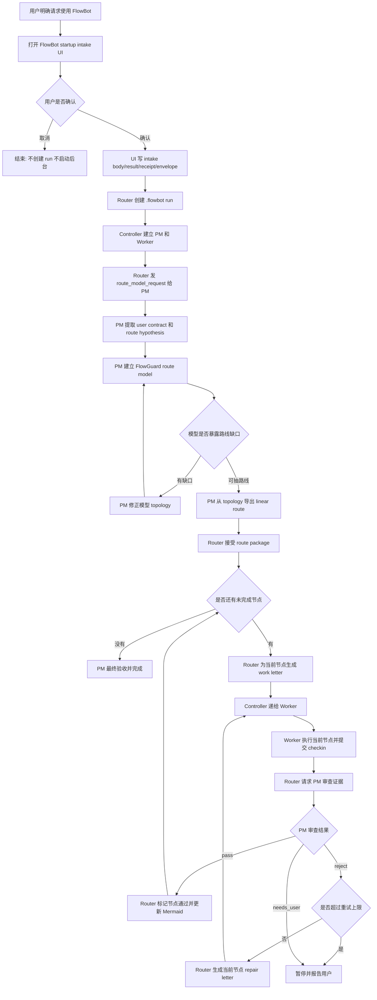

# FlowBot 工作流草图

这是当前 MVP 已实现的主流程。FlowBot 已有从 FlowPilot 裁剪的 native startup intake；headless demo 仍保留用于快速验证。



建议状态:

```text
INTAKE_WAITING
INTAKE_CANCELLED
RUN_CREATED
ROLES_READY
PM_MODELING
ROUTE_PACKAGE_SUBMITTED
ROUTE_ACCEPTED
NODE_DISPATCHED
WORKER_SUBMITTED
PM_REVIEWING
NODE_PASSED
NODE_REJECTED
NODE_RETRYING
PAUSED
DONE
```

关键原则:

- Controller 只递信和管理后台智能体。
- PM 用 FlowGuard 生成路线, 不是先写普通计划再验证。
- Router 只执行 PM 从模型拓扑中导出的 linear route。
- Worker 每轮只处理当前节点。
- 审查失败只退回当前节点。
- 用户始终通过 Mermaid 看到大进度。
